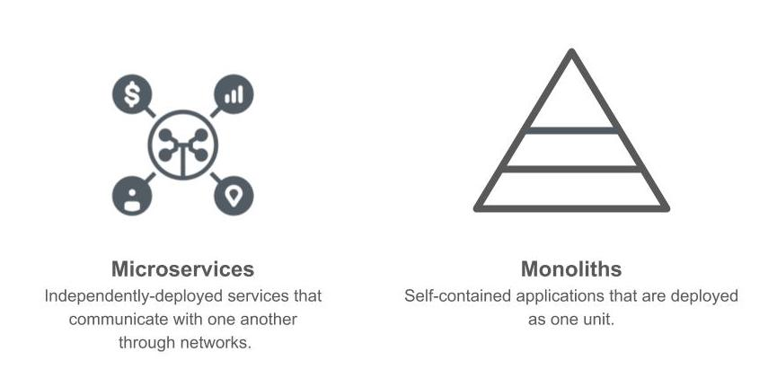
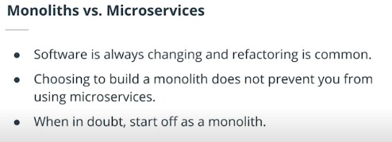
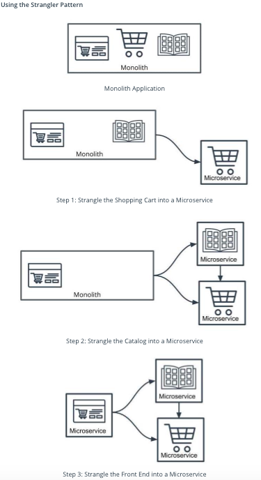

## Introduction To Microservices
**Microservices** is an architectural style where our application is composed of modules that can be independently developed and deployed. It basically means instead of having a larger application; we would have a multiple applications that has a defined responsibility and they are all tied together to work in unison.
* Utilize smaller, cost-effective machines for what we need
* Flexibility to implement logic in a way that makes sense for the team and business
* Lean to be targeting a specific business purpose
* Interfaces set up for building out other applications
* Try not to overcommit and pay for resources that aren't needed

**Monoliths** are self-contained appplications that are deployed as one unit.
* Utilize a powerful, more costly machine
* Codebase is centralized and easy manage
* Code is easily shared across the project
* Scoped for worst-case usage across all parts of the application

### Considerations for Not Using Microservices
* ***System Complexity***
Rather than deploying a single application, we would be deploying multiple modules separately. There is more overhead in setting up projects.
* ***Network Latency***
By introducing a network between modules, we have increased latency in application performance and will find it harder to debug our application. 
* ***Difficulty with Debugging***
We can no longer rely on a stack trace or tools that can help us pinpoint where a bug is. We may end up relying on logging to find causes of issues.

In Microservices we can update a specific part when there is an update buth with Monoliths we have to replace the entire application if there is an update. 

#### Microservice Benefits
* **Scale** - 
Lean applications that are able to tailor their logic and infrastructure to their specific business needs. More-easily architected for horizontally-scaling. 
* **Development in Parallel** - 
Teams can develop and deploy their own codebases. 
* **Cost Effectiveness** - 
Utilize resources only for what is necessary for the specific microservice. 
* **Flexibility** - Choose technologies that make the most sense for the team and business.

        

    

        Its easier to refactor a Monolith to a Microservice than viseversa. 

#### Properties of Microservices
* ***Communication***
  * Services communicate through a network
  * REST is currently the most-commonly used network interface
* ***Independently Deployed***
    * Deployment to one service should not affect another
* ***Fault tolerant***
    * Diligence in writing code that can anticipate when another microservice isn’t working

### Divide a Monolith Application Into Microservices
The Strangler Pattern is a strategy of refactoring code by incrementally replacing components of the codebase and its the most common way to migrate legacy applications.

