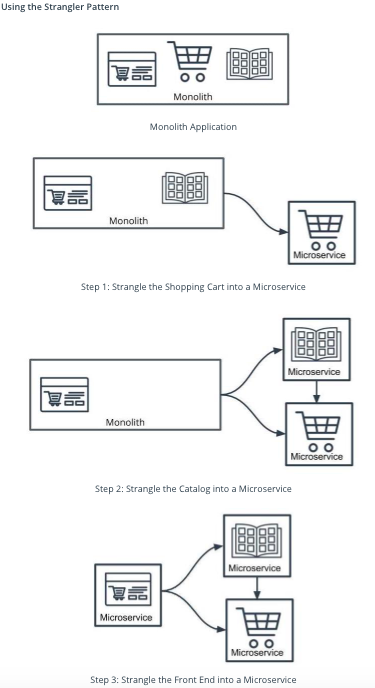
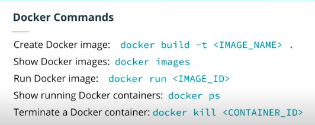
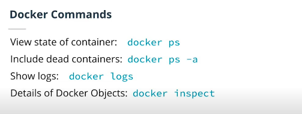
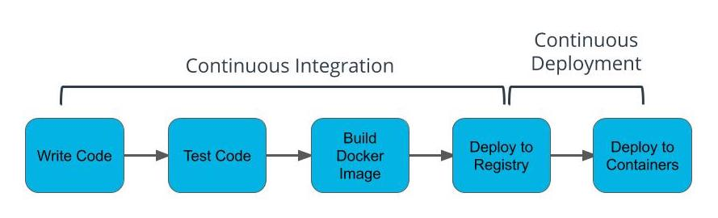
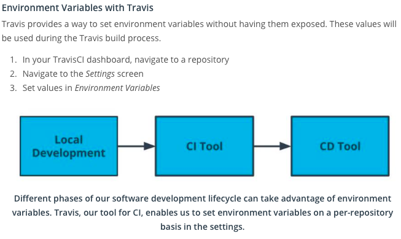
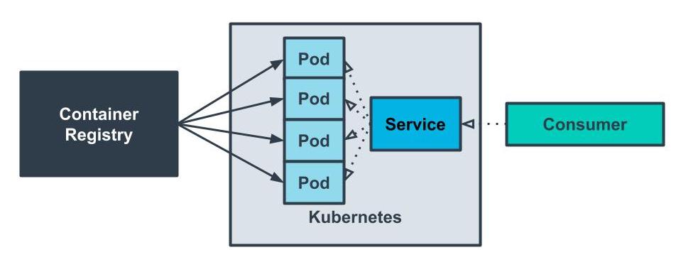
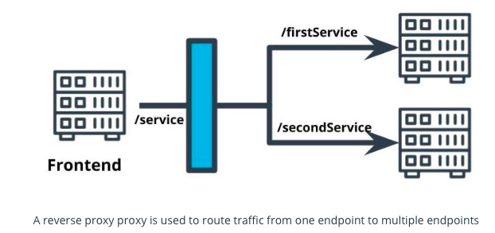

## Introduction To Microservices
**Microservices** is an architectural style where our application is composed of modules that can be independently developed and deployed. It basically means instead of having a larger application; we would have a multiple applications that has a defined responsibility and they are all tied together to work in unison.
* Utilize smaller, cost-effective machines for what we need
* Flexibility to implement logic in a way that makes sense for the team and business
* Lean to be targeting a specific business purpose
* Interfaces set up for building out other applications
* Try not to overcommit and pay for resources that aren't needed

**Monoliths** are self-contained appplications that are deployed as one unit.
* Utilize a powerful, more costly machine
* Codebase is centralized and easy manage
* Code is easily shared across the projectcd 
* Scoped for worst-case usage across all parts of the application

### Considerations for Not Using Microservices
* ***System Complexity***
Rather than deploying a single application, we would be deploying multiple modules separately. There is more overhead in setting up projects.
* ***Network Latency***
By introducing a network between modules, we have increased latency in application performance and will find it harder to debug our application. 
* ***Difficulty with Debugging***
We can no longer rely on a stack trace or tools that can help us pinpoint where a bug is. We may end up relying on logging to find causes of issues.

In Microservices we can update a specific part when there is an update buth with Monoliths we have to replace the entire application if there is an update. 

#
#### Microservice Benefits
* **Scale** - 
Lean applications that are able to tailor their logic and infrastructure to their specific business needs. More-easily architected for horizontally-scaling. 
* **Development in Parallel** - 
Teams can develop and deploy their own codebases. 
* **Cost Effectiveness** - 
Utilize resources only for what is necessary for the specific microservice. 
* **Flexibility** - Choose technologies that make the most sense for the team and business.

        

    

        Its easier to refactor a Monolith to a Microservice than viseversa. 

#### Properties of Microservices
* ***Communication***
  * Services communicate through a network
  * REST is currently the most-commonly used network interface
* ***Independently Deployed***
    * Deployment to one service should not affect another
* ***Fault tolerant***
    * Diligence in writing code that can anticipate when another microservice isn’t working

### Divide a Monolith Application Into Microservices
**The Strangler Pattern** is a strategy of refactoring code by incrementally replacing components of the codebase and its the most common way to migrate legacy applications.

#
## Containers

It packages your code with all its dependecies and ship it full. It means that containers are self-contained applications with all the dependencies needed to run; they can be treated as one unit of deployment. 

**Containers are Ephemeral**
* Containers should be stateless and are expected to be destroyed.
* Containers are self-contained so deployment is simply swapping out an existing container with a new one.
* Each container can be running its own versioned software. We resolve the issue where different applications may have different dependencies.

*Ephemeral - a property where a resource is expected to be terminated.*

**Docker** - is a platform that helps us manage the process of creating and managing our containers.

***Docker Image*** -  When we have an application that we want to deploy, we can package it into a Docker Image. The image contains all of your code and dependencies.

***Docker Container*** - is an ephemeral running instance of a Docker Image.

***Dockerfile*** - defines the steps to create a Docker Image.

#

## Docker Commands 

N.B - docker-exec -it sh

***Container Registry*** - 
A container registry serves as a centralized place for us to store and version our images.

#
## Deployment Pipelines - CI/CD
*Deployment pipelines simplify how we deploy Docker containers.*

 **Continuous Integration (CI)** - process in which code is tested, built into a Docker image, and deployed to a container registry.

**Continuous Deployment (CD)** - process in which our Docker image is deployed to containers.

* CI/CD allows for a tight feedback loop
* Bugs are inevitable -- CI/CD helps us identify them in a deployed environment
* CI/CD makes the pipeline more available

### Docker 
**docker build .** will run the Dockerfile to create an image

**docker images** will print all the available images

**docker run {IMAGE_ID}** will run a container with the image

**docker ps** will print all the running containers

**docker kill {CONTAINER_ID}** will terminate the container

**docker exec -it sh** - Attaching to a Container

**docker logs** - viewing logs 

**docker inspect** - View Details of Docker Objects

# 

### Travis CI
* Travis is a tool that helps us with the CI process
* Travis integrates with your application using a YAML file
* YAML files are often used to specify configurations.
* Travis can be used to build and push images to DockerHub

### Alternatives to Travis CI 

* **Jenkins** - most flexible but more overhead of setup
* **CircleCI** - alternative to Travis CI with many competing features
* **AWS CodeBuild**- integrates easily with other AWS tools

        
        With CI/CD, if Travis is our CI tool, then Kubernetes is our CD tool    

## Service Orchestration With Kubernetes
* Orchestration helps us handle complicated workflows in deploying our application
* Helps us automate our deployment process for continuous deployment

#### Kubernetes
* A container orchestration system packed with features for automating our application’s deployment
* Enables us to easily scale our application and ship new code
#### Pods
* Containers often need to communicate with one another. It's not uncommon to see a deployment involving a few containers to be deployed.

* Kubernetes **pods** are abstractions of multiple containers and are also ephemeral.

#### Services
* Applications are often deployed with multiple replicas. This helps *with load balancing and horizontal scaling.
* Services are an abstraction of a set of pods to expose them through a network*.

*Horizontal Scaling - Handling increased traffic by creating additional replicas so that traffic can be divided across the replicas*

### Commands 
**kubectl** - provides a wide range of commands to interact with Kubernetes. 

**kubectl get pods** - show the pods in the cluster

**kubectl describe services** - show the services in the cluster

**kubectl cluster-info** - display information about the cluster

 * More commands in the [Kubernetes Cheatsheet](https://kubernetes.io/docs/reference/kubectl/cheatsheet/)

#
## Best Practices 
#### Reverse Proxy 

**Reverse Proxy**
* A single interface that forwards requests on behalf of the client and appears to the client as the origin of the responses.
* Useful for abstracting multiple microservices to appear as a single resource.
  

# 
## Securing the Microservices

|         |                      |
| --------|:--------------------:|
| Ingress | Inbound web traffic  |
| Egress  | Outbound web traffic |

* AWS *security groups* Enables you to restrict the inbound and outbound traffic for AWS resources.
  
* Kubernetes *Ingress and Egress* Enables you to restrict the inbound and outbound traffic for Kubernetes resources.

**Horizontal Pod Autoscaler** - 
A deployment feature that allows additional pods to be created when a CPU usage threshold is reached.

    kubectl autoscale deployment <NAME> --cpu-percent=<CPU_PERCENTAGE>                --min=<MIN_REPLICAS>
    --max=<MAX_REPLICAS>

**Liveness Probe** - A monitoring activity that occurs at scheduled intervals to ping a health check API endpoint to validate that the application is in a healthy state.

**Resilience** - 	The property of an application to handle and recover from failures.
