# Introduction to Serverless 

A serverless is a spectrum of solutions servers are managed by someone else
allow to scale up and down easily
pay for what you use. 

### Benefits of Serveless
* Low entry barrier
* Cost efficient
* High-availability and scalability

## Serverless Components
* **FaaS** (Function as a service) : write code in individual functions and deploy them to a platform to be executed, e.g - AWS Lambda, Azure Functions ... etc.

* **Datastores**: Storage of data e.g S3, DynamoDb,Firebase.
  
* **Messaging**: Send messages from one application to another, e.g, Amazon SQS,Google pub/sub ... etc.

* **Services**: Services that provide functionalities where we don't need to manage servers; i.e. authentication, ML, video processing,  e.g Auth, Big Data, ML ... etc.

        
         We can mix serverless with not serverless. 

#### Function as a Service - FaaS
* Split application into small functions
* Event driven
* Pay per invocation
* Rest is handled by a cloud provider

##### Different Event sources for our AWS Lambda function. 
  * There are more than 40 Event sources but here are few
  
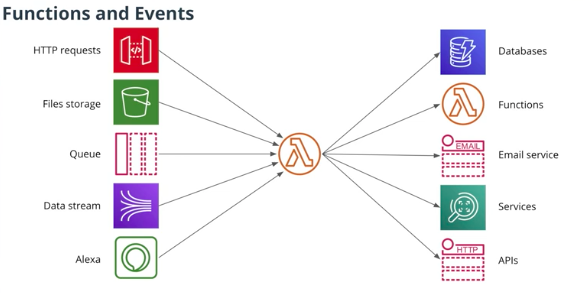

* we can directly configure Memory and Timeout for an AWS Lambda function.

### Lambda function vs AWS Lambda
*  AWS Lambda - is a computing service that runs code in response to events from Amazon Web Services.
  
*  Lambda function - is a single function connected to an event source running in AWS Lambda.

### [AWS Lambda limitations ](https://docs.aws.amazon.com/lambda/latest/dg/gettingstarted-limits.html)

* At most 3GB of memory per execution
* Functions can run no more that 15 minutes
* Can only write files to /tmp folder
* Limited number of concurrent executions - (limit can be lifted!)
* Event size up to 6 MB - (256 Kb Asynchronous)

### Error Handling 
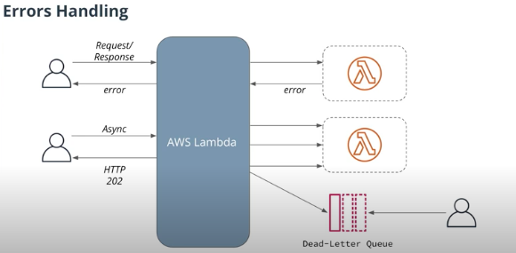
  * **Request/response method**: If there's an error in the function, then it will return immediately to the caller, which can process the error from the Lambda function.
  * **Async method:** Instead of returning an error to the user, AWSLambda will return HTTP 202 code to the user and it will store a request into an internal queue. Additionally, it will try to call the Lambda function up to 3 times. If all of those times result into an error, then it will store the event into a "dead-letter queue", which stores all the events that the Lambda function failed to process.
  
  
### Serverless Benefits

|     Pros    |      Cons        |
| --------|:--------------------:|
| Easy to develop & low cost  | Not for heavy workloads  |
| Scalability and reliability  | platform limitaions |
| focus on business value | vendor lock-in |

### API Gateway
* Entry point for API users
* Pass requests to other services
* Process incoming requests

### API Gateway End point Types 
  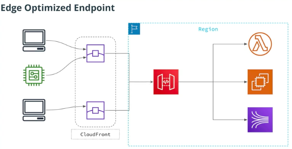\
   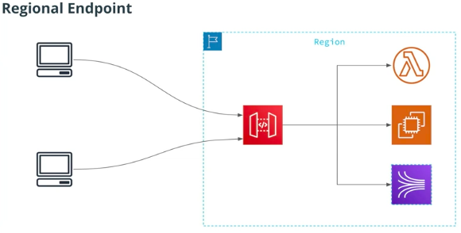
    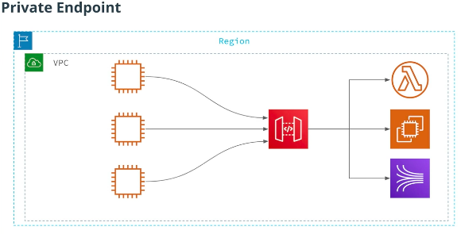

N.B - Edge optimazed is better if our API is to be used by geographically distributed group of users.

#### Lambda integration modes

* **Proxy** - passes all request information to a Lambda function. Easier to use.
* **Non-proxy** - allows to transform incoming request using **Velocity Template Language**

### DynamoDB
  * NoSQL database 
      * Key-value store - every item should have key 
      * Document datastore - every item can be a complex document
  * Scalable Database 
  * Low latency 
  * Serverless 
  * High Avaliablity 

### DynamoDB Features 
  * Schemaless 
  * Query via API
  * ACID Transaction (**A**tomicity **C**onsistency **I**solation **D**urability)
  * Update Streams
  * Global Tables 
  * Backups 

 

### DynamoDB Capacity Modes

DynamoDB has two capacity modes:

* **Provisioned capacity** - we need to define the maximum amount of read/write requests DynamoDB can handle. The higher the limit we set, the more we have to pay per month. Requests are throttled if we go above the specified limit.
  
* **On-Demand** - DynamoDB will handle as many requests as we send, and we pay per-request. Can be more expensive comparing to Provisioned capacity, but is better for applications with unpredictable traffic patterns.

N.B - Every item in DynamoDB should have a partition key.

### Serverless 
* Standardized way of deploying an application
* create necessary resources
* Manage Applications - Remove applications, call functions, ru application locally 
  
#### Serverless Providers
  * **Serverless** framework - its the most developed 
  * **Zappa** is another serverless app and only supports Python.
  * **Serverless Application Model(SAM)** - from AWS, CloudFormation extention.
  * **Claudia.js** - it only supports Node.js and AWS. 

#### Why Serverless Framework
  * Its the most popular framework
  * Dozons of plugins 
  * Huge Community 
  * It can be used with AWS, Azure, Google Cloud, Kubeless, IBM OpenWhisk and etc.
  * It supports many programming languages as well.
  

### YAML
  * Common configuration file format 
  * Superset of JSON, yaml is more concise format 
  * Indentation with spaces like phyton 
  
  
   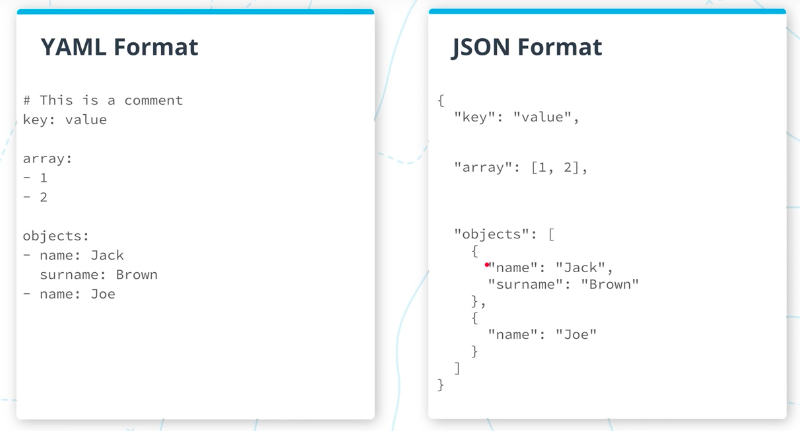

   

  * [Resource to convert from YAML code to JSON and vice versa](https://www.json2yaml.com/)
  *  [Serverless Plugins](https://www.serverless.com/plugins/)

#

### Serveless Framwork Concept 

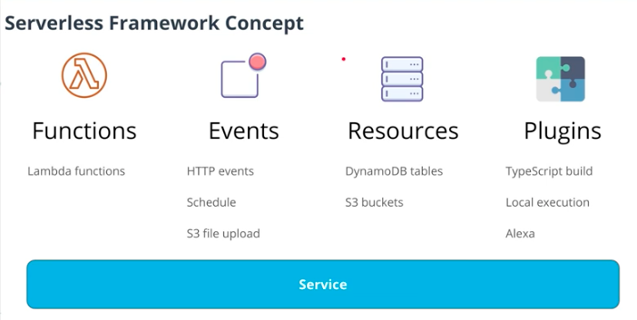

### Serverless Project Structure
* /node_modules
   * plugins, prod. and dev. dependencies
* /src
  * function.js
* serverless.yml
    * Provider - provider specific config
    * Functions - functions in our service
    * Plugins - plugins to extend Serveless Framework (https://github.com/serverless/plugins)
    * Resources - additional cloud resources  
* package.json

* package-lock.json

### Serveless.yml 

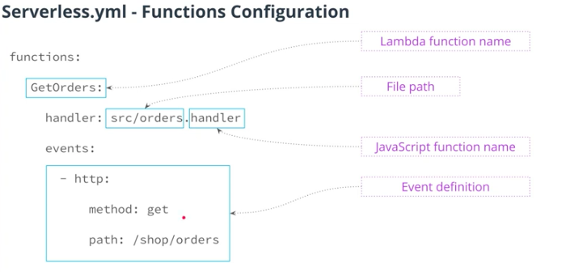

### Supported events in Serverless 
* **API GATEWAY** -  REST/WebSocket API
* **SQS** - Simple Queue Service
* **Alexa** - for voice applications 
* **CloudWatch Events** - scheduling events 
* **CloudWatch Logs** - process log events
* **Kinesis,DynamoDB** - process a stream of updates

### Serverless in a Nutshell 
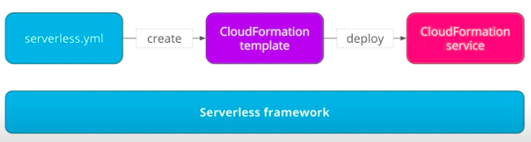

### CloudFormation 
  * Cloudformation is a service from AWS that allows us to create and manage AWS resources. 
* its Declerative 
* CloudFormation allows us to
  * Write YAML/JSON config file
  * Changes state of AWS resources
  * Version control the infrastructure
  
* it's free you only pay for created resources.

        CloudFormation is Amazon's version of Terraform.

  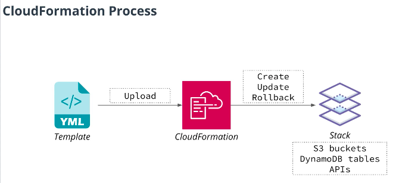

  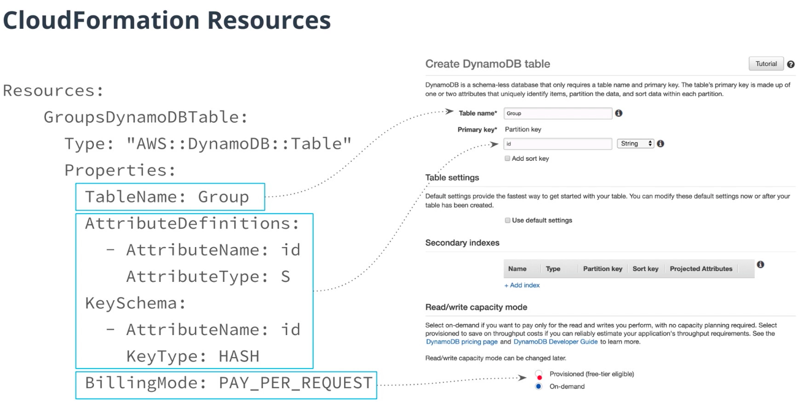

  ### Old DynamoDB Terminalogy in Cloudformation
  * **Partition** Key - used to be **HASH** key 
  * **Sort** Key - used to be **Range** key 

  * This old terminalogies are still used in linbraries and cloudformation
  
  AWS documentation provides reference for all resource types CloudFormation support: [AWS Resource and Property Types Reference](https://docs.aws.amazon.com/AWSCloudFormation/latest/UserGuide/aws-template-resource-type-ref.html)

  ### Using Serverless Framework 
  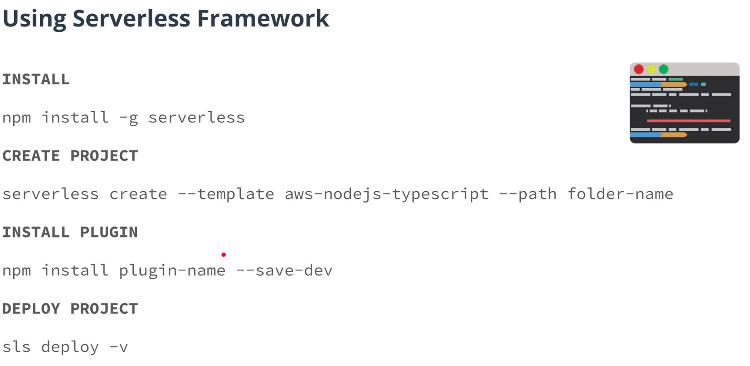

  * when we run **serveless/sls deply -v** serveless will convert our serverless YAML to CloudFormation template and upload it to CloudFormation to deploy our application.
  
  * Configure serverless to use the AWS credentials :
   
         sls config credentials    --provider aws --key YOUR_ACCESS_KEY --secret YOUR_SECRET_KEY --profile serverless*
        
  

  ### Composite key

A composite key in DynamoDB consists of two elements

* Partition key - what partition to write item to
* Sort key - to sort elements with the same partition key
  
*Together - uniquely identify an item, meaning there can be no two items in a table with the same values of composite key.*

## EVENT PROCESSING 

### Image Upload files

 we can use the code snippet below to generate a signed url 
    

     const s3 = new AWS.S3({
       signatureVersion: 'v4' // Use Sigv4 algorithm
     })
     const presignedUrl = s3.getSignedUrl('putObject', { // The URL will allow to perform the PUT operation
       Bucket: 's3-bucket-name', // Name of an S3 bucket
       Key: 'object-id', // id of an object this URL allows access to
       Expires: '300'  // A URL is only valid for 5 minutes
     })

  ## Cloud Formation Reference 

  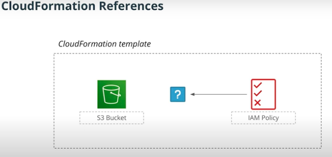

  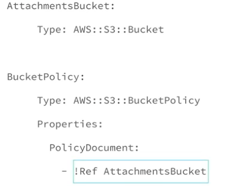

  

