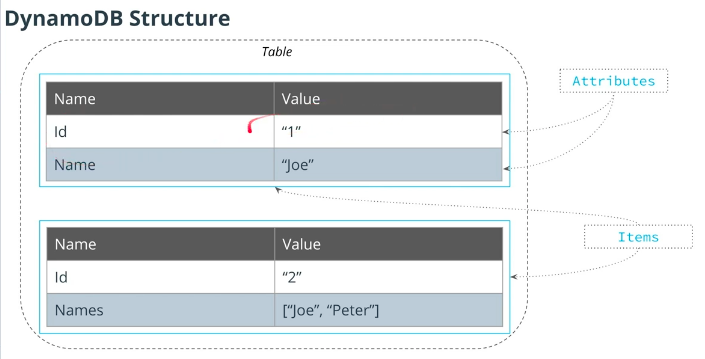

# Introduction to Serverless 

A serverless is a spectrum of solutions servers are managed by someone else
allow to scale up and down easily
pay for what you use. 

### Benefits of Serveless
* Low entry barrier
* Cost efficient
* High-availability and scalability

## Serverless Components
* **FaaS** (Function as a service) : write code in individual functions and deploy them to a platform to be executed, e.g - AWS Lambda, Azure Functions ... etc.

* **Datastores**: Storage of data e.g S3, DynamoDb,Firebase.
  
* **Messaging**: Send messages from one application to another, e.g, Amazon SQS,Google pub/sub ... etc.

* **Services**: Services that provide functionalities where we don't need to manage servers; i.e. authentication, ML, video processing,  e.g Auth, Big Data, ML ... etc.

        
         We can mix serverless with not serverless. 

#### Function as a Service - FaaS
* Split application into small functions
* Event driven
* Pay per invocation
* Rest is handled by a cloud provider

##### Different Event sources for our AWS Lambda function. 
  * There are more than 40 Event sources but here are few
  

* we can directly configure Memory and Timeout for an AWS Lambda function.

### Lambda function vs AWS Lambda
*  AWS Lambda - is a computing service that runs code in response to events from Amazon Web Services.
  
*  Lambda function - is a single function connected to an event source running in AWS Lambda.

### [AWS Lambda limitations ](https://docs.aws.amazon.com/lambda/latest/dg/gettingstarted-limits.html)

* At most 3GB of memory per execution
* Functions can run no more that 15 minutes
* Can only write files to /tmp folder
* Limited number of concurrent executions - (limit can be lifted!)
* Event size up to 6 MB - (256 Kb Asynchronous)

### Error Handling 

  * **Request/response method**: If there's an error in the function, then it will return immediately to the caller, which can process the error from the Lambda function.
  * **Async method:** Instead of returning an error to the user, AWSLambda will return HTTP 202 code to the user and it will store a request into an internal queue. Additionally, it will try to call the Lambda function up to 3 times. If all of those times result into an error, then it will store the event into a "dead-letter queue", which stores all the events that the Lambda function failed to process.
  
  
### Serverless Benefits

|     Pros    |      Cons        |
| --------|:--------------------:|
| Easy to develop & low cost  | Not for heavy workloads  |
| Scalability and reliability  | platform limitaions |
| focus on business value | vendor lock-in |

### API Gateway
* Entry point for API users
* Pass requests to other services
* Process incoming requests

### API Gateway End point Types 
  \
   
    

N.B - Edge optimazed is better if our API is to be used by geographically distributed group of users.

#### Lambda integration modes

* **Proxy** - passes all request information to a Lambda function. Easier to use.
* **Non-proxy** - allows to transform incoming request using **Velocity Template Language**

### DynamoDB
  * NoSQL database 
      * Key-value store - every item should have key 
      * Document datastore - every item can be a complex document
  * Scalable Database 
  * Low latency 
  * Serverless 
  * High Avaliablity 

### DynamoDB Features 
  * Schemaless 
  * Query via API
  * ACID Transaction (**A**tomicity **C**onsistency **I**solation **D**urability)
  * Update Streams
  * Global Tables 
  * Backups 

 

### DynamoDB Capacity Modes

DynamoDB has two capacity modes:

* **Provisioned capacity** - we need to define the maximum amount of read/write requests DynamoDB can handle. The higher the limit we set, the more we have to pay per month. Requests are throttled if we go above the specified limit.
  
* **On-Demand** - DynamoDB will handle as many requests as we send, and we pay per-request. Can be more expensive comparing to Provisioned capacity, but is better for applications with unpredictable traffic patterns.

N.B - Every item in DynamoDB should have a partition key.

### Serverless 
* Standardized way of deploying an application
* create necessary resources
* Manage Applications - Remove applications, call functions, ru application locally 
  
#### Serverless Providers
  * **Serverless** framework - its the most developed 
  * **Zappa** is another serverless app and only supports Python.
  * **Serverless Application Model(SAM)** - from AWS, CloudFormation extention.
  * **Claudia.js** - it only supports Node.js and AWS. 

#### Why Serverless Framework
  * Its the most popular framework
  * Dozons of plugins 
  * Huge Community 
  * It can be used with AWS, Azure, Google Cloud, Kubeless, IBM OpenWhisk and etc.
  * It supports many programming languages as well.
  

### YAML
  * Common configuration file format 
  * Superset of JSON, yaml is more concise format 
  * Indentation with spaces like phyton 
  
  
   

   

  * [Resource to convert from YAML code to JSON and vice versa](https://www.json2yaml.com/)
  *  [Serverless Plugins](https://www.serverless.com/plugins/)

#

### Serveless Framwork Concept 

### Serverless Project Structure
* /node_modules
   * plugins, prod. and dev. dependencies
* /src
  * function.js
* serverless.yml
    * Provider - provider specific config
    * Functions - functions in our service
    * Plugins - plugins to extend Serveless Framework (https://github.com/serverless/plugins)
    * Resources - additional cloud resources  
* package.json

* package-lock.json

### Serveless.yml 

### Supported events in Serverless 
* **API GATEWAY** -  REST/WebSocket API
* **SQS** - Simple Queue Service
* **Alexa** - for voice applications 
* **CloudWatch Events** - scheduling events 
* **CloudWatch Logs** - process log events
* **Kinesis,DynamoDB** - process a stream of updates

### Serverless in a Nutshell 

### CloudFormation 
  * Cloudformation is a service from AWS that allows us to create and manage AWS resources. 
* its Declerative 
* CloudFormation allows us to
  * Write YAML/JSON config file
  * Changes state of AWS resources
  * Version control the infrastructure
  
* it's free you only pay for created resources.

        CloudFormation is Amazon's version of Terraform.

  

  

  ### Old DynamoDB Terminalogy in Cloudformation
  * **Partition** Key - used to be **HASH** key 
  * **Sort** Key - used to be **Range** key 

  * This old terminalogies are still used in linbraries and cloudformation
  
  AWS documentation provides reference for all resource types CloudFormation support: [AWS Resource and Property Types Reference](https://docs.aws.amazon.com/AWSCloudFormation/latest/UserGuide/aws-template-resource-type-ref.html)

  ### Using Serverless Framework 
  

  * when we run **serveless/sls deply -v** serveless will convert our serverless YAML to CloudFormation template and upload it to CloudFormation to deploy our application.
  
  * Configure serverless to use the AWS credentials :
   
         sls config credentials    --provider aws --key YOUR_ACCESS_KEY --secret YOUR_SECRET_KEY --profile serverless*
        
  

  ### Composite key

A composite key in DynamoDB consists of two elements

* Partition key - what partition to write item to
* Sort key - to sort elements with the same partition key
  
*Together - uniquely identify an item, meaning there can be no two items in a table with the same values of composite key.*

## Requests Validation

* You can read more about requests validation with API Gateway in the [official documentation](https://docs.aws.amazon.com/apigateway/latest/developerguide/api-gateway-method-request-validation.html)

  
* For the Demo we used the post method doesnt have any validations to vlalidate incoming requests. We will use JSON schema to validate it.

* we i wll *install -- 
     serverless-aws-documentation serverless-reqvalidator-plugin*
then 

#### We are building an image sharing application
# 
### Design a DynamoDB to store our images 
* As this is a NoSQL Database we need to think about our queries first, but in SQL DB we would design it not based on what queries we want to perform.
* We need to support the following 
     *  Get image by id
     *  Get images for a group
    
             Just partion key wont work because if our table has just a partition key only supports two operations get element by id and scan, which is slow for the bigger tables. 

* Another option that we can use is a **Composite Key**.

#### Composite Key
* a Key consits of two elements 
  *  Partition Key - what partition to write item to 
  *  Sort key  - to sort elements with the same partition key 
  *  Together - uniquely identify an item 

            If a table has a composite key, there can be multiple items with the same partition key, providing they have different values of sort key.

* if we have a Composite Key it allows us to use addditional operation 
    * Query - Allows us to get a subset of elements with a **specified partition key.**
    * Its efficient to query big datasets.
  
### DynamoDB Queries 
* Provide partition key 
* Can perform the following queries 
* Get alll item with a particular key 
    * Filter by the value of the sort key 
    * Filter by the value of any other attribute 

#### Composite Key Allowed Operators 
* <,> <=, >=, =
* BETWEEN - to check if a value of a key is in between the range that we want
* BEGINS_WITH - to check if a string value of a source key starts with a specified substring. 
      
      We can have multiple items with the same partition key but diffrent sort key

When DynamoDb puts the data its given it hashes it and puts on the tables. 

#
### DynamoDB supports two indexes types:

* Local secondary index (LSI):

   *   Like an additional sort key
    Allows to sort items by a different attribute
    Added on the data in a table

* Global secondary index (GSI) --(very fast and efficent and cost effective)

  * Allows to define a new partition key for the same data
Allows to define a new partition and sort key for the same data
Creates copy of the data in a table (data is available via GSI after some delay)

#

## EVENT PROCESSING 

### Image Upload files

# File Upload     

## File upload Using EC2 
 * Classical approch would be this following below 
    
    * This traditional approach  
      * Cons - Needs to setup infrastructure for EC2 and this is what serverless is trying to solve in the first place. 

## File upload - Lambda 
  * This is a serverless approach - no need to manage our 
  infrastructure. 
    * Cons  
      * Lambda event can be upto 6 MB in size
      * Need to pay for lambda invocation time.
  
  
    
## Presigned URL 
*Presigned URL is a special URL pointing to an S3 bucket that can be used by anyone to upload/read an object. It can be used to access an S3 bucket even if it is private.*

*This is the better solution if we want to upload larger images.*  

  * Presigned URL is a Special URL pointing to an S3 Bucket 
  * it can be used by anyone to upload/read an object 
    * This will work even if the S3 bucket is private. 
  * Presigned URL will be generated by lambda 
    * Lambda should have write permissions to S3
      * Won't write to the bucket it self.
      * Wont generate proper URL without correct permissions.
  * Pros- This is the serverless approach 
    * No need to manage our infrastructure 
    * No need to process file uploads
  
    
    
 **We can use the code snippet below to generate a signed url** 
    

     const s3 = new AWS.S3({
       signatureVersion: 'v4' // Use Sigv4 algorithm
     })
     const presignedUrl = s3.getSignedUrl('putObject', { // The URL will allow to perform the PUT operation
       Bucket: 's3-bucket-name', // Name of an S3 bucket
       Key: 'object-id', // id of an object this URL allows access to
       Expires: '300'  // A URL is only valid for 5 minutes
     })

  ## Cloud Formation Reference 

  

  

#

## Processing S3 Events 

**Here is a configuration snippet that can be used to subscribe to S3 events:**

    functions:
      process:
        handler: file.handler
        events:
          - s3: bucket-name
            event: s3:ObjectCreated:*
            rules:
                - prefix: images/
                - suffix: .png
  

- Currrently - There is an issue with Serverless and S3
  - We create an S3 bucket explicitly in the Resources section 
  - Tries to create an S3 bucket from event definition 
  - Will have to connect Lambda and S3 events manually
    - We can use **serverless-external-s3-event** plugin
 
  

  ### Process S3 Notification 
    * Connect a Lambda fuction to S3 notification 
  

## Implementing WebSocket Notification 
  * Will notify users when image is uploaded 
    * it realtime 
    * Clients wont have to poll data 
    * Notifications are sent to clients 
    * Allows bidirection communication 
    * 

        Websockets work on top of tcp connection. It connects two servers and have a persistent Connection.

      *  

* WebSocket allows to implement bi-directional communication between a web application and a server. It can be especially useful for applications like: 
    * Messaging Applications
    * Real-time Notifications
    * Real-time Dashboards

### WebSocket API provides two URLs: 
  * **WebSocket URL and Connection URL.**

* 
### WebSocket URL:
* Clients will use to connect to the API
* Allows clients to send messages and receive notifications

### Connection URL
* Send a message back to a connected client
* Lambda function will use to send messages
* Requires a connection id to send a message to a particular client
  * Connection URL supports the following operations:
    * POST: to send a message to a client
    * GET: to get the latest connection status
    * DELETE: to disconnect a client from API
  * 

## Special Routes in API GATEWAY 
  * **$connect** - is an event that is send to a lambda function when a user is connected via websockets. 
  * **$disconnect** - is an event that is send to a lambda function when a user is disconnected from the websockets. 
   * **$default** - is an event that is sent when an incoming message doesnt match any route or the user send a non JSON event.

   * 
     
 

 **Here is an example of how to react to WebSocket events using Serverless Framework:**

    ConnectHandler:
        handler: src/websocket/connect.handler
        events:
          - websocket:
              route: $connect

      DisconnectHandler:
        handler: src/websocket/disconnect.handler
        events:
          - websocket:
              route: $disconnect
* 
  
  

#
  ### FULL TEXT SEARCH 
  * Find images by name
    * Supports serach by any field 
    * Tolerates typos 
    * Support highlight
    * Rank Search Result
*
       DynamoDB doesnt support text search   

### Elasticsearch 
  * It's the most popular full-text search solution 
    * Open Source
    * AWS is just Elasticsearch provider
  * It supports all the features we need 
    * search by any field 
    * Highlights - it highlights the matches 
    * Ranking 
    * Fuzzy Search 

### Data Streaming Services 
  * **Apache Kafka** - open source
    * Managed version of Apache Kafka
    * Allows to store any streaming data
  * **Kinesis** - AWS source 
    * Separate data stream service
    * Allows to store any streaming data
    * Similar to Kafka (Open Source data streaming platform)
  
  * **DynamoDB**
    * Provides a stream of all updates applied to DynamoDB tables
    * Only contains operations performed on DynamoDB tables
  
#### Data Stream 
  * A stream of binary records 
  * Like a queue 
    * Unlike a queue, each record can be read multiple times
  * Two types of users 
    * Consumers - read records 
    * Producers - add new records 
#### Scaling a Data Stream
  * Should be able to scale 
    * Process millions and millions of messages 
  *  The solution is to scaling a NoSQL database
     *  Split a stream into multiple parts 
     *  Each part is called a **Shard**
        * A Shard is selected as its the same as DynamoDB
            * Every record has a key and key is hashed 
            * Hash is then used to select a shard.
   * 

### Elasticsearch
  * Data in Elasticsearch 
    * Indexes - like tables in a database
    * split among multiple shards
  * Managed service from AWS
  * Deploys and configures it for us
    * Can create it with CloudFormation 
  * Creates two services
    * **Elasticsearch** - for uploading data and queries 
    * **Kibana** - UI for Elasticsearch   

   * 

    AWS provides multiple ways to restrict access to a Kibana dashboard. 
      
    One option to restrict access to Kibana would be to use Amazon Cognito, a service for authentication, authorization, and user management.