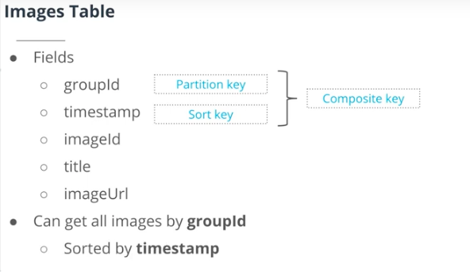
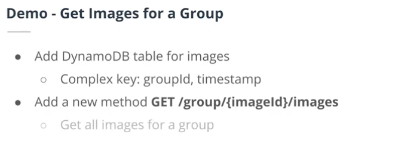
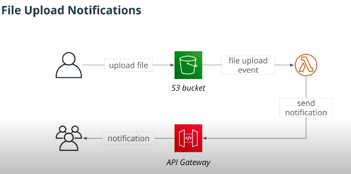
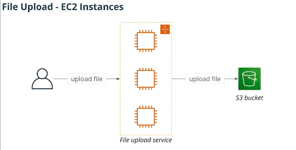
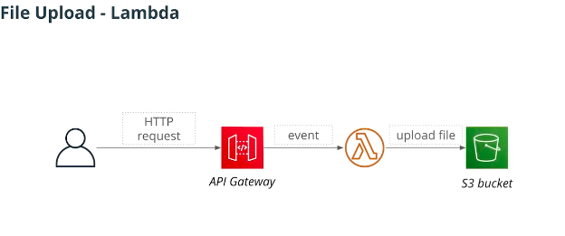
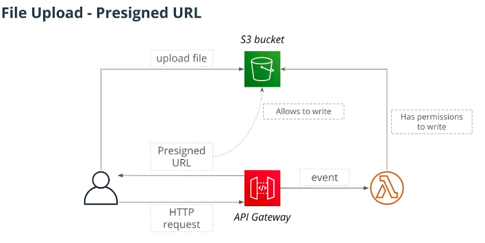

## Requests Validation

* You can read more about requests validation with API Gateway in the [official documentation](https://docs.aws.amazon.com/apigateway/latest/developerguide/api-gateway-method-request-validation.html)

  
* For the Demo we used the post method doesnt have any validations to vlalidate incoming requests. We will use JSON schema to validate it.

* we i wll *install -- 
     serverless-aws-documentation serverless-reqvalidator-plugin*
then 

#### We are building an image sharing application

## Images API
* Create an image 
* Get images for a group
* Get images by id 

* Upload an image 
* Image upload Notification 

### Design a DynamoDB to store our images 
* As this is a NoSQL Database we need to think about our queries first, but in SQL DB we would design it not based on what queries we want to perform.
* We need to support the following 
     *  Get image by id
     *  Get images for a group
    
             Just partion key wont work because if our table has just a partition key only supports two operations get element by id and scan, which is slow for the bigger tables. 

* Another option that we can use is a **Composite Key**.

#### Composite Key
* a Key consits of two elements 
  *  Partition Key - what partition to write item to 
  *  Sort key  - to sort elements with the same partition key 
  *  Together - uniquely identify an item 

            If a table has a composite key, there can be multiple items with the same partition key, providing they have different values of sort key.

* if we have a Composite Key it allows us to use addditional operation 
    * Query - Allows us to get a subset of elements with a **specified partition key.**
    * Its efficient to query big datasets.
  
### DynamoDB Queries 
* Provide partition key 
* Can perform the following queries 
* Get alll item with a particular key 
    * Filter by the value of the sort key 
    * Filter by the value of any other attribute 

#### Composite Key Allowed Operators 
* <,> <=, >=, =
* BETWEEN - to check if a value of a key is in between the range that we want
* BEGINS_WITH - to check if a string value of a source key starts with a specified substring. 
      
      We can have multiple items with the same partition key but diffrent sort key

When DynamoDb puts the data its given it hashes it and puts on the tables. 

  
  ### Out Image Table will include 
* Fields 
  * GroupId -- Partition Key --- Composite Key 
  * timestamp -- Sort Key  ---- Composite Key
  * imageId
  * title
  * imageUrl
   
   

    

### Image Upload 
* We are going to implement 
  * Images upload to S3
  * Notify other users when a file is uploaded 
    * WebSockets 
    * Use S3 Notification 
  * Full-text search  

#

# File Upload     

## File upload Using EC2 
 * Classical approch would be this following below 
    
    * This traditional approach  
      * Cons - Needs to setup infrastructure for EC2 and this is what serverless is trying to solve in the first place. 

## File upload - Lambda 
  * This is a serverless approach - no need to manage our 
  infrastructure. 
    * Cons  
      * Lambda event can be upto 6 MB in size
      * Need to pay for lambda invocation time.
  
  
    
## Presigned URL 
*Presigned URL is a special URL pointing to an S3 bucket that can be used by anyone to upload/read an object. It can be used to access an S3 bucket even if it is private.*

*This is the better solution if we want to upload larger images.*  

  * Presigned URL is a Special URL pointing to an S3 Bucket 
  * it can be used by anyone to upload/read an object 
    * This will work even if the S3 bucket is private. 
  * Presigned URL will be generated by lambda 
    * Lambda should have write permissions to S3
      * Won't write to the bucket it self.
      * Wont generate proper URL without correct permissions.
  * Pros - This is the serverless approach 
    * No need to manage our infrastructure 
    * No need to process file uploads
  
    

**Here is a code snippet that can be used to generate a presigned URL:**

          const s3 = new AWS.S3({
            signatureVersion: 'v4' // Use Sigv4 algorithm
          })
          const presignedUrl = s3.getSignedUrl('putObject', { // The URL will allow to perform the PUT operation
            Bucket: 's3-bucket-name', // Name of an S3 bucket
            Key: 'object-id', // id of an object this URL allows access to
            Expires: '300'  // A URL is only valid for 5 minutes
          })